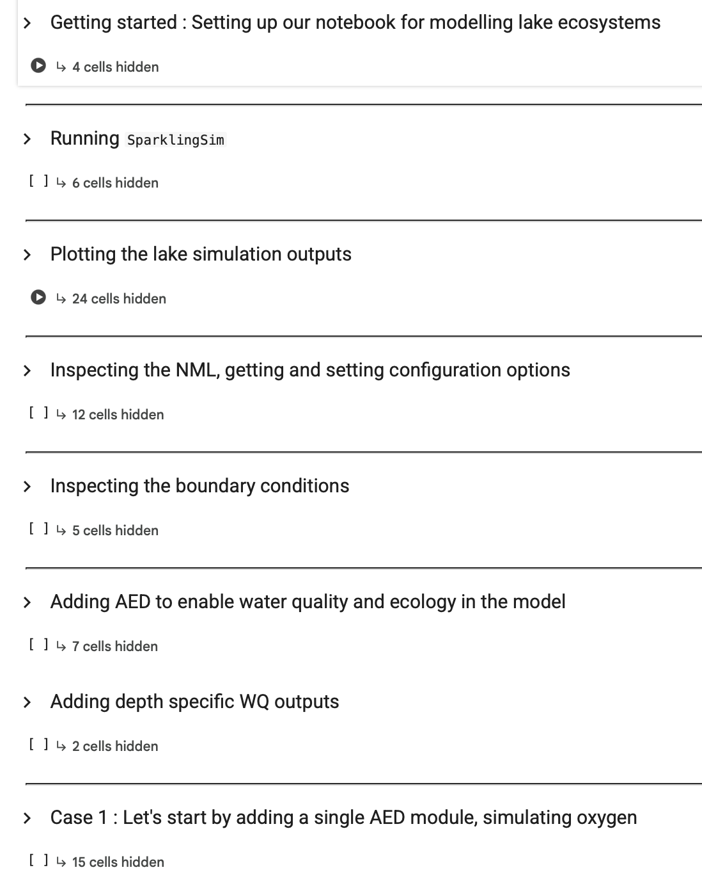
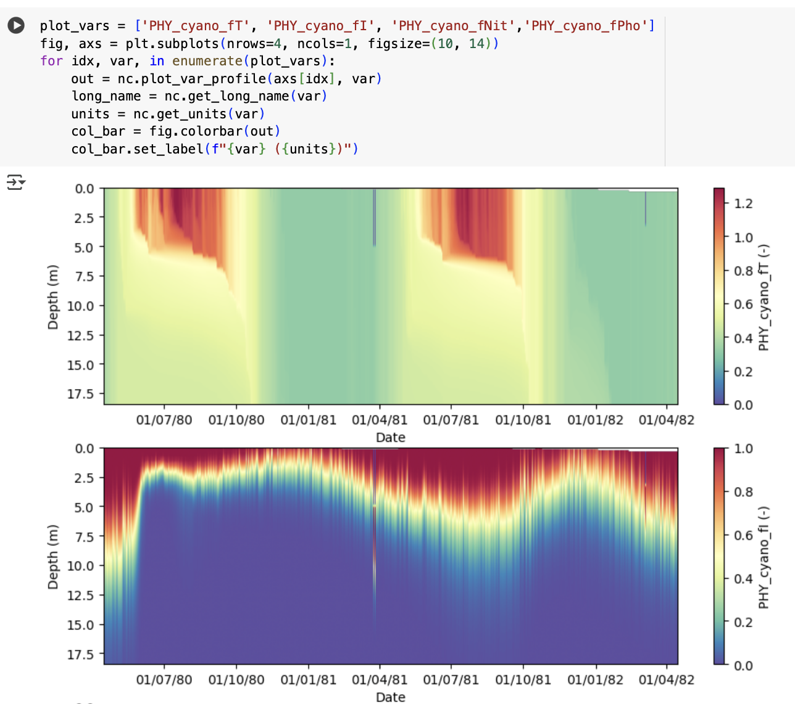

# efi-workshop  

This repo is materials for an AED workshop for the [EFI 2025 Conference](https://ecoforecast.org/efi-2025-conference/) using a pre-release of `glm-py` v0.5. 

The workshop has users to sequentially develop a aquatic ecosystem model of a temperate freshwater lake. Pre-configured templates of model configurations of increasing complexity (from oxygen to zooplankton) are included and visualised through a Jupyter notebook. To launch the notebook, click on the `Google Colab` button above.

## Contact

For further information please review the workshop slides, which include contacts.
